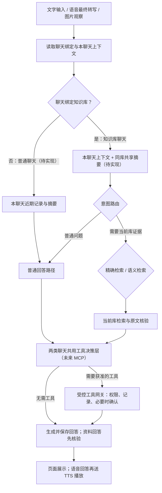

<p align="center"></p>

# CiteRAG

面向本地单用户的多模态知识助手。CiteRAG 使用 **LightRAG** 建立资料索引，将文字、语音最终转写和图片观察交给同一套问答服务；知识库回答附带可核查的原文来源，普通回答明确标明未检索知识库。

> **开发中**：仓库展示的是持续开发的本地版本，不提供生产部署承诺。默认关闭模型入库和问答；代码、合成测试或局部真实供应商验证均不代表完整业务验收通过。

## 主要能力

| 能力 | 当前实现 |
| --- | --- |
| 资料管理 | 上传 TXT、Markdown、文字 PDF 和普通 DOCX；查看解析、索引、失败原因与持久任务；支持删除、替换和受管重建。 |
| 文字问答 | 在固定知识库聊天中自动区分普通回答与知识库回答；后者选择精确或语义检索，核验来源后保存正文与引用。 |
| 图片提问 | PNG/JPEG 由视觉模型生成观察，再进入现有问答链路；图片不会自动入库，观察与知识库证据分开显示。 |
| 实时语音 | LiveKit 音轨、火山 ASR、本地 Silero VAD、统一问答服务、MiniMax TTS 与浏览器播放；支持字幕、插话取消和文字降级。 |
| 聊天与状态 | 原始消息、回答尝试、摘要和任务保存在业务库；页面提供重试、来源查看、错误状态及系统状态。 |

这些是代码中已接线的能力，完成度与验证范围见[开发路线](docs/development/ROADMAP.md)及[验证记录](docs/README.md)。目前一个聊天仍须绑定一个知识库；无库普通聊天、同库跨聊天摘要和 MCP 工具调用属于后续目标。

## 界面与数据流


上图是历史 UI 切片在合成资料下的浏览器截图，不是当前业务数据或完整验收。现行 React B 界面及桌面、手机截图见 [UI 交付记录](design/ui/react-candidates/README.md)。


原始文件保存在本机私有目录；业务 PostgreSQL 保存资料、解析块、任务、聊天和回答，独立的 PostgreSQL/pgvector 引擎库保存 LightRAG 索引。图中数据库名是示意值，实际名称由部署配置决定。详细边界见[技术架构](docs/多模态知识助手_技术选型与架构设计_v0.1.md)。

## 快速开始

需要 Python 3.12、[uv](https://docs.astral.sh/uv/)、Node.js 22.12+ 和 pnpm 10.33.0。先确认 `8000` 与 `5173` 端口空闲；不要停止来源不明的服务。

先克隆并进入仓库；随后从仓库根目录分别打开两个终端：

```powershell
git clone https://github.com/JX05120LLL/CiteRAG.git
cd CiteRAG
```

后端终端：

```powershell
cd backend
uv sync --locked
uv run --no-env-file uvicorn app.main:app --host 127.0.0.1 --port 8000 --workers 1 --no-proxy-headers
```

前端终端：

```powershell
cd frontend
pnpm install --frozen-lockfile
pnpm dev
```

打开 `http://127.0.0.1:5173/`；独立语音入口为 `http://127.0.0.1:5173/voice.html`。上述步骤仅启动**无数据库、无模型配置**的工作台，系统状态会如实显示未配置，不会生成演示资料或自动调用供应商。

要实际上传、检索和通话，还需分别配置 PostgreSQL 业务库、PostgreSQL/pgvector 引擎库、受控模型凭证及本地 LiveKit，并显式完成所需业务迁移。请按[本地开发指南](docs/development/LOCAL-DEVELOPMENT.md)操作；不要将真实连接串、密钥、原文或备份提交到仓库。`CITERAG_INGESTION_ENABLED` 与 `CITERAG_ANSWER_ENABLED` 默认均为 `false`。

## 技术组成

| 层 | 技术与职责 |
| --- | --- |
| 界面 | React、TypeScript、Vite、Ant Design / Ant Design X；工作台与独立语音页。 |
| API 与任务 | FastAPI、SQLAlchemy、Alembic；本地归属、资料生命周期、聊天和任务。 |
| 知识引擎 | 固定版本的 [LightRAG](https://github.com/HKUDS/LightRAG) SDK，配合 PostgreSQL/pgvector；回答前仍由应用核对原文位置与引用。 |
| 模型 | 百炼文本、Embedding、重排与图片观察；火山流式 ASR、MiniMax TTS、本地 Silero VAD。 |
| 媒体 | 本地自托管 LiveKit；语音最终转写后复用文字问答的 AnswerService。 |

仓库主要目录：`backend/` 为 API、模型适配和迁移；`frontend/` 为正式界面；`docs/` 为产品、架构、开发和验证文档；`assets/brand/` 为正式品牌资产；`design/ui/` 保存当前设计说明及历史截图。

## 使用边界与后续方向

- 当前仅面向本机回环地址和单用户安装，没有账号、局域网或公网访问控制。
- 一个聊天目前固定一个就绪知识库；普通回答虽不检索资料，仍发生在该聊天内。聊天目前按最后一次用户输入起 180 天的规则处理。
- 上传受理不等于解析、建索引或核验成功。资料维护时暂停该库问答；图片观察和聊天摘要不能充当知识库原文证据。
- 完整聊天保存在业务库，每轮请求只选择必要的近期消息、摘要与本轮证据；上下文预算的进一步调整仍在开发验证中。
- M0 的 Embedding 超长输入边界、完整 M1 验收、真人语音设备与完整 M2、实际业务库中的图片闭环仍有待验证。阶段结果以[路线图](docs/development/ROADMAP.md)和各[验证记录](docs/README.md)为准。

下一阶段计划让聊天可选择不绑定知识库，并为同一知识库的多个聊天增加受控共享摘要；普通无库聊天目标为保留到使用者主动删除。两类聊天未来可通过统一权限边界调用外部工具。以下是**目标流程，尚未实现**：



无库聊天不会自动读取知识库；共享摘要只帮助理解背景，不能代替本轮检索证据。详细目标见 [PRD 0.3](docs/多模态知识助手_PRD_v0.2_单企业首版.md#03-下一阶段已确认目标尚未实现)。

## 开发与文档

```powershell
cd backend
uv run --no-env-file ruff check .
uv run --no-env-file pytest -q
cd ../frontend
pnpm test
pnpm typecheck
pnpm lint
pnpm build
```

数据库测试需要独立、可丢弃的测试库；未配置时跳过不等于通过。CI 只使用公开合成资料和临时 PostgreSQL，不调用真实模型或验收私人数据。更多入口见[文档导航](docs/README.md)、[当前 UI 细化记录](docs/development/UI-POLISH-2026-09-29.md)、[CI 说明](docs/development/CI.md)和[贡献指南](CONTRIBUTING.md)。

## 许可与致谢

项目尚未选定自身的开源许可证，也没有发布许可文件；公开可见的源码不等于已授予复制、修改和再分发许可。正式开放贡献与发布前需确定许可证并核对依赖和素材许可。

知识引擎使用 [LightRAG](https://github.com/HKUDS/LightRAG) 的固定提交版本；语音界面参考并改写了 LiveKit 官方 starter 的布局，其来源和 MIT 许可见[供应商声明](frontend/vendor/livekit/README.md)。依赖、固定版本及用途见[上游参考](docs/REFERENCES.md)。
