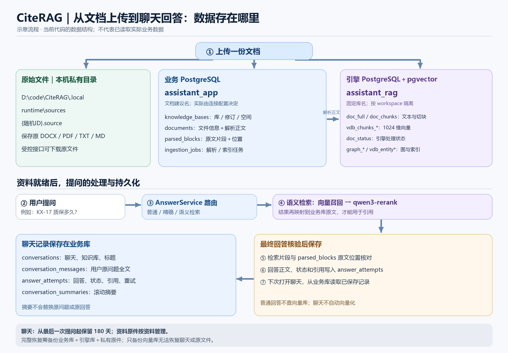
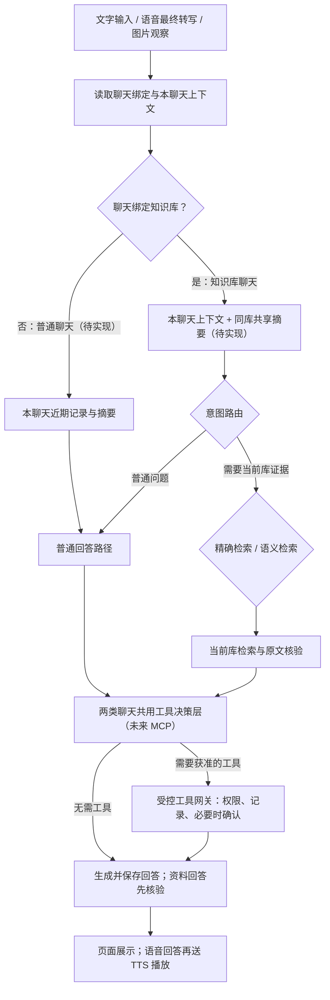

<p align="center"></p>

<h1 align="center">CiteRAG</h1>

<p align="center">
  让本地资料变成有原文可查的回答<br>
  文字、语音与图片提问，共用同一条问答链路
</p>

<p align="center">
  <a href="backend/pyproject.toml"></a>
  <a href="backend/pyproject.toml"></a>
  <a href="frontend/package.json"></a>
  <a href="frontend/package.json"></a>
  <a href="docs/多模态知识助手_技术选型与架构设计_v0.1.md"></a>
</p>
<p align="center">
  <a href="https://github.com/HKUDS/LightRAG"></a>
  <a href="frontend/vendor/livekit/README.md"></a>
  <a href="https://github.com/JX05120LLL/CiteRAG/actions/workflows/ci.yml"></a>
</p>

<p align="center">
  <a href="#-快速开始">快速开始</a> ·
  <a href="#-工作台预览">界面预览</a> ·
  <a href="docs/README.md">文档导航</a> ·
  <a href="docs/development/ROADMAP.md">开发路线</a>
</p>

> **开发中**：CiteRAG 是本地单用户项目。代码已接线、合成测试、真实供应商调用和完整业务验收是不同层级；当前不承诺生产可用。入库和问答默认关闭，需自行配置数据库与模型服务后显式启用。

## 🎨 CiteRAG 是什么

CiteRAG 使用 [LightRAG](https://github.com/HKUDS/LightRAG) 为本地资料建立知识索引。你可以上传文档，在固定知识库中用文字或语音提问，也可以附图片让模型先观察，再依据当前问题决定是否需要检索资料。

知识库回答会回查受管原文、核验事实和引用后保存；问候及通用问题走普通回答，并明确标明没有检索知识库。当前一个聊天必须绑定一个知识库，即使这轮问题最终走普通回答。

## ✨ 为什么做 CiteRAG

- **答案可追溯**：来源指向本轮可核对的原文位置；证据不足时明确说明，不把常识包装成资料结论。
- **三种输入共用问答服务**：文字、语音最终转写和图片观察进入同一套意图路由、检索、核验与聊天记录。图片观察本身不是知识库引用。
- **资料和任务有真实状态**：上传受理、解析、索引、核验及失败分别展示；处理失败可查看原因，资料维护会暂停相关问答。
- **本地数据边界清楚**：原始文件留在本机私有目录；业务记录与 LightRAG 索引分别存于 PostgreSQL 业务库和引擎库。

## 🧭 从上传到回答

1. **上传资料**：接收 TXT、Markdown、文字 PDF 或普通 DOCX，保存原文件与资料任务。
2. **解析入库**：检查文档结构和内容，写入受管原文；LightRAG 建立索引后还要核验资料状态，上传成功并不等于可问答。
3. **提出问题**：文字直接进入工作台；语音仅在 ASR 最终转写后提交；图片先生成有不确定性标记的文字观察。
4. **选择路径**：普通问题由模型结合本聊天上下文回答；需要当前库事实的问题选择精确定位或语义检索。
5. **核验并保存**：资料回答核对证据、事实和引用，保存后才交给 TTS 播放；普通语音回答可分段提前播报，最终状态仍写入聊天。

## 🧰 已接入的能力

| 场景 | 当前代码能力 |
| --- | --- |
| 知识库与资料 | 创建和维护知识库，批量上传、查看任务、失败原因、删除、替换和受管重建。 |
| 文字问答 | 自动区分普通回答与知识库回答；知识库回答选择精确或语义检索，保留来源、历史和重试。 |
| 图片提问 | PNG/JPEG 私有附件先经视觉模型观察；不确定编号可要求确认，图片不会自动入库。 |
| 实时语音 | LiveKit 音轨、火山 ASR、本地 Silero VAD、共用问答、MiniMax TTS 和浏览器播放；提供字幕、插话取消与文字降级。 |
| 状态与记录 | 原问题、回答尝试、摘要和持久任务保存在业务库；工作台显示来源、错误与系统状态。 |

上表表示**代码已接线**，不是完整 M0—M3 验收结论。具体证据和剩余条件见[验证文档](docs/README.md)。

## 🖥️ 工作台预览


这张图是早期 UI 切片在合成资料下的浏览器截图，不代表当前 React 页面或真实业务验收。现行 React B 界面的桌面和手机截图见[界面记录](design/ui/react-candidates/README.md)。

## 🗂️ 数据保存在哪里



原始 DOCX、PDF、TXT 和 Markdown 保存在本机私有目录；业务 PostgreSQL 保存资料、解析块、任务、原始聊天、回答尝试与摘要；独立的 PostgreSQL/pgvector 引擎库保存 LightRAG 索引。图中的数据库名与路径是**示意值**，以实际配置为准。聊天摘要不会替换原始消息，索引也不能单独恢复原文件或聊天。详见[技术架构](docs/多模态知识助手_技术选型与架构设计_v0.1.md)。

## 🚀 快速开始

需要 Python 3.12、[uv](https://docs.astral.sh/uv/)、Node.js 22.12+ 和 pnpm 10.33.0。先确认本机 `8000` 与 `5173` 端口空闲，不要停止来源不明的服务。

```powershell
git clone https://github.com/JX05120LLL/CiteRAG.git
cd CiteRAG
```

在仓库根目录打开两个终端。

**终端一：后端**

```powershell
cd backend
uv sync --locked
uv run --no-env-file uvicorn app.main:app --host 127.0.0.1 --port 8000 --workers 1 --no-proxy-headers
```

**终端二：前端**

```powershell
cd frontend
pnpm install --frozen-lockfile
pnpm dev
```

打开 [工作台](http://127.0.0.1:5173/) 或[独立语音页](http://127.0.0.1:5173/voice.html)。这些命令可启动**无数据库、无模型配置**的界面和 API；系统状态会如实显示缺失的服务，不会生成演示资料或自动请求供应商。

### ⚙️ 启用完整功能

| 需要准备 | 作用 |
| --- | --- |
| PostgreSQL 业务库及显式迁移 | 保存知识库、受管原文、任务与聊天。 |
| PostgreSQL/pgvector 引擎库 | 存放 LightRAG 索引；与业务库隔离。 |
| 受控后端模型配置 | 入库、Embedding、重排、文字回答和图片观察；凭证不写入前端或 Git。 |
| 本地自托管 LiveKit 与语音服务 | 开启实时通话、火山 ASR、MiniMax TTS 和本地 VAD。 |

完整接入需要安装相应后端可选依赖，按[本地开发指南](docs/development/LOCAL-DEVELOPMENT.md)配置、迁移并核对服务。默认 `CITERAG_INGESTION_ENABLED=false`、`CITERAG_ANSWER_ENABLED=false`；配置凭证或打开页面都不会自动授权付费调用。不要把实际业务库、私人资料或密钥用于公开测试。

## 🏗️ 技术与项目结构

- **界面**：React、TypeScript、Vite、Ant Design / Ant Design X。
- **应用**：FastAPI、SQLAlchemy、Alembic，负责资料、会话、任务、来源和状态。
- **知识引擎**：固定版本 LightRAG SDK 与 PostgreSQL/pgvector。
- **媒体**：本地 LiveKit；语音最终转写交给现有 AnswerService。

```text
CiteRAG/
├── backend/       API、模型适配、知识引擎接入与迁移
├── frontend/      正式工作台与独立语音入口
├── docs/          产品、架构、开发和分层验证记录
├── assets/brand/  正式标志
└── design/ui/     界面设计与历史截图
```

## 🧪 当前验证边界

- GitHub CI 使用公开合成资料与临时 PostgreSQL，执行静态检查、测试和构建；它不调用真实模型，也不验收私人业务数据。
- 已有局部真实供应商与合成语音验证记录，不能替代真人设备、真实资料及完整语音质量验收。
- M0 的 Embedding 超长输入边界、完整 M1 验收、完整 M2 真人语音验收和实际业务库图片闭环仍有未完成项。以[开发路线](docs/development/ROADMAP.md)及各[验证记录](docs/README.md)为准。

## 📑 文档

- [产品需求与下一阶段决定](docs/多模态知识助手_PRD_v0.2_单企业首版.md)
- [技术选型与架构](docs/多模态知识助手_技术选型与架构设计_v0.1.md)
- [本地开发与配置](docs/development/LOCAL-DEVELOPMENT.md)
- [意图路由与有据回答](docs/development/INTENT-AND-GROUNDED-ANSWERS.md)
- [语音链路与验收](docs/development/M2-VOICE-VALIDATION.md)
- [完整文档导航](docs/README.md) · [贡献指南](CONTRIBUTING.md)

## 🗺️ 下一阶段

计划让聊天可以不绑定知识库；知识库聊天保留固定库，并逐步加入同库跨聊天共享摘要。普通无库聊天的目标是保留到使用者主动删除。未来两类聊天都可通过统一受控层使用外部工具。这些**尚未实现**，当前仍受知识库绑定和 180 天聊天保留规则约束。



无库聊天不会自动读取知识库；共享摘要只用于理解背景，不能代替本轮原文证据。实施顺序和数据兼容要求见[路线图](docs/development/ROADMAP.md)。

## 🙏 致谢与许可

CiteRAG 使用 [LightRAG](https://github.com/HKUDS/LightRAG) 作为知识引擎；语音界面参考并改写了 LiveKit 官方 starter 的布局，来源及 MIT 声明见[供应商说明](frontend/vendor/livekit/README.md)。更多依赖来源见[上游参考](docs/REFERENCES.md)。

项目**尚未选择自身的开源许可证**，仓库也没有项目 `LICENSE` 文件。公开可见不等于已授予复制、修改或再分发许可；正式开放使用与贡献前仍需确定许可证并核对素材声明。
