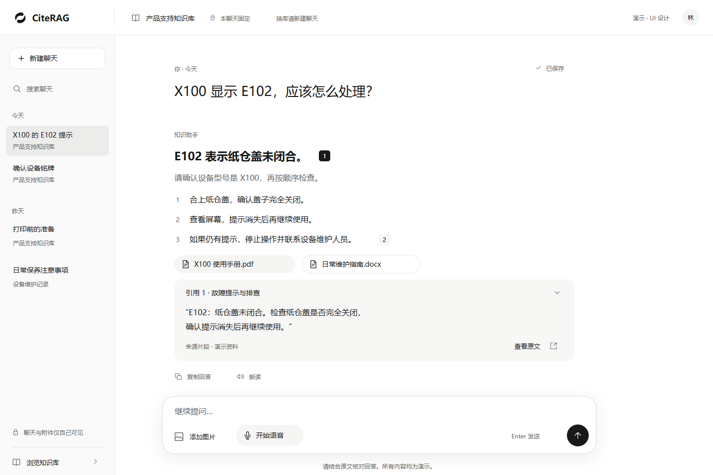

# CiteRAG

A local, single-user multimodal knowledge assistant, designed around answers with verifiable sources.

本地单用户多模态知识助手。使用者直接管理自己的知识库，通过文字、实时语音和图片提问，核查回答来源，并保存聊天继续交流。首版无需注册、登录或创建管理员。

**当前阶段：M0 未完成；M1-1 已提交，M1-2、M1-3 及 M1-4 的主要本机实现已完成，完整 M1 尚未验收。** 四类文字资料、受管入库、普通/精确问答、真实来源、固定库聊天、近期窗口/摘要及资料删除/替换与旧空间清理已接通；聊天改名/删除、分页与同消息回答重试也已实现。入库与问答默认分别关闭（`CITERAG_INGESTION_ENABLED=false`、`CITERAG_ANSWER_ENABLED=false`），不会自动发起模型请求；本轮仅使用本地模型替身。真正的 SSE 流式回答等缺项及分层证据见 [M1 计划](docs/development/M1-IMPLEMENTATION.md)和 [M1 验证](docs/development/M1-VALIDATION.md)。

五模型与真实百炼双库验收沿用 M0 证据；超长 Embedding 输入边界仍暂缓未通过。本轮新增真实模型请求为 0。接手本轮 8000 API、5174 前端和 55432 业务库不可达，未读取实际 schema；上轮核查为 `0002_local_single_user`、旧 API 无新接口，不能当作当前在线事实。新增 `0004`—`0006` 只在隔离库升级；实际业务库未迁移、旧 API 未重启。原生 TypeScript、A 版 UI 与「回响」Logo 保留。

收尾复核时既有 API、前端与业务库不可达，引擎库仍可连接，停止原因未定位；开始时的可用状态不能作为当前状态。详情及恢复前提见 [交接](docs/development/HANDOFF.md)。

## 从这里开始

- [文档目录](docs/README.md)：PRD、技术架构与阅读顺序。
- [开发路线与 M0 清单](docs/development/ROADMAP.md)：接入验证 → 文字 → 语音 → 图片 → 试用。
- [M1 分步计划](docs/development/M1-IMPLEMENTATION.md)与[验证记录](docs/development/M1-VALIDATION.md)：知识库管理、受管资料与任务、后续切片及分层证据。
- [当前进度与下次交接](docs/development/HANDOFF.md)：已验证基线、模型准备、剩余工作与续接提示词。
- [本地开发](docs/development/LOCAL-DEVELOPMENT.md)：安装、启动、配置边界与独立数据库测试。
- [本地单用户调整](docs/development/M0-LOCAL-SINGLE-USER.md)：2026-09-22 确认的范围、数据兼容与验收计划。
- [M0 验证记录](docs/development/M0-VALIDATION.md)：实际检查、模拟验证及尚未完成的真实接入条件。
- [GitHub CI](docs/development/CI.md)：自动构建、静态检查与临时 PostgreSQL/API 冒烟验证；专用测试文件仅在本机保留。
- [UI 设计说明](design/ui/README.md)：四张 1440 × 960 桌面稿及预览方法。
- [正式 Logo](assets/brand/README.md)：无字图形、反白、应用图标及下载。
- [贡献约定](CONTRIBUTING.md)：范围、验证、数据与提交要求。

## 本地查看设计

克隆仓库后，用浏览器打开 `design/ui/index.html`，无需安装依赖或联网。页面切换、缩放和下载可操作；画面内部的问答、语音和管理按钮是静态设计。Logo 展示页为 `design/brand/index.html`。

仓库保留已选 UI 的 SVG、PNG 与设计参数，可从预览页查看、下载或直接编辑 SVG。设计生成工具仅在维护者本机保留，不随仓库发布。PNG 是浏览器导出的设计快照；不同系统的中文字体可能产生排版差异。

## 产品与技术边界

计划采用原生 TypeScript + HTML/CSS、Vite、FastAPI、LightRAG、PostgreSQL 与 LiveKit。具体依赖锁定及服务能力在 M0 实测；本项目不使用 React/Vue。

- 一个聊天固定一个知识库；换库需新建聊天。
- 知识库、聊天和附件属于同一本地安装；不同浏览器访问的是同一份本地资料。
- 通话中发送新文字或图片问题前需挂断。
- 图片观察与知识库依据分开；提问图片不会自动加入知识库。
- 资料维护期间暂停该库问答；上传完成不等于入库成功。
- API 仅在本机回环地址使用；首版不包含多用户、账号管理、局域网共享、多租户、实时订单连接器或图谱编辑。

完整范围和验收条件以 [PRD](docs/多模态知识助手_PRD_v0.2_单企业首版.md) 为准。当前没有发布版本、性能实测或生产部署。

## 参考与许可

LightRAG 是已用于 M0 受控双库验收的知识引擎，LiveRAG 为架构及交互参考。固定提交与来源见[参考清单](docs/REFERENCES.md)。两个上游项目的完整源码、虚拟环境和本地资料不纳入本仓库。

本项目许可证尚待维护者选择，暂不将公开可见等同于已授予开源使用许可。引入依赖或复制上游代码前，按其实际许可证保留必要声明。
