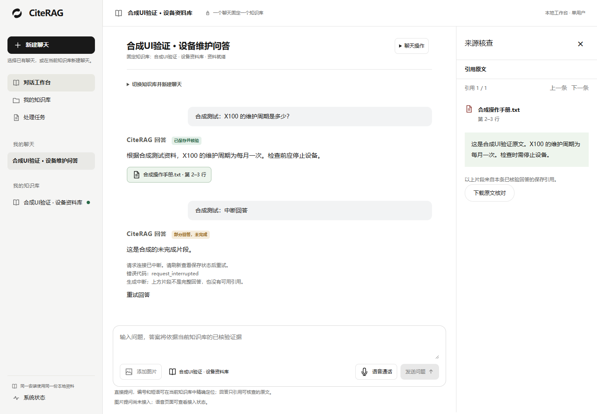

# CiteRAG

A local, single-user multimodal knowledge assistant, designed around answers with verifiable sources.

**文字问答改进（2026-09-26）：** 单输入框自动区分普通交流、通用解释和知识库查询；支持结合上下文追问、基于真实证据的总结与独立事实支持检查。通用回答明确标记未检索知识库；详细机制、费用影响和集中验收步骤见[交流分流与有依据的总结](docs/development/INTENT-AND-GROUNDED-ANSWERS.md)。完整 M1 仍待验收。

本地单用户知识助手，面向带可核查来源的文字问答，并计划扩展图片提问和实时语音。使用者直接管理自己的知识库、核查原文，并保存聊天继续交流。首版无需注册、登录或创建管理员。

**当前阶段：M0 未完成；M1-1 至 M1-4 的本机主链路已实现，完整 M1 尚未验收。** 当前接通四类文字资料、受管入库、自动路由普通/精确问答、固定知识库聊天、来源核查、删除/替换与旧空间清理。回答支持 SSE 增量、`partial` 持久状态和重试；来源只在完整回答核验并提交后展示。另有断流恢复、近期窗口/摘要、180 天聊天保留和可选每日成套备份。分层证据和剩余条件见 [M1 计划](docs/development/M1-IMPLEMENTATION.md)与 [M1 验证](docs/development/M1-VALIDATION.md)。

**2026-09-26 UI 升级：** 按已确认的三张概念稿调整工作台、知识库和独立语音页；统一侧栏、输入区、来源与任务详情栏，并适配手机导航。资料与历史任务支持分页、折叠，失败资料可查看安全错误说明与关联任务。原生 TypeScript + HTML/CSS + Vite 和「回响」Logo 保留，未引入 React/Vue。截图、控件—API 对应和验收步骤见 [UI 升级交付](design/ui/UI-UPGRADE-20260926.md)。

**语音接入首片：** 经用户允许提前启动 M2，已接 LiveKit 官方 SDK、本地媒体凭证、麦克风、静音、音频播放与挂断。语音 UI 已按用户选择原生移植官方页面，独立入口 `voice.html` 与工作台共用实现，保持 TypeScript/Vite。配置默认关闭，页面明确标记“语音助手尚未接入”；ASR、知识库语音回答、TTS 和正式通话租约仍待完成，图片入口仍禁用。已验证真实本地 WebRTC 与合成音频，不等于真人设备或完整语音验收。[原生语音页截图与验证](design/ui/VOICE-NATIVE-20260926.md)、[M2 启动步骤](docs/development/M2-LIVEKIT-TRANSPORT.md)。

入库、问答和备份在仓库配置中默认关闭，真实模型调用需单独授权。上传受理、解析完成、建立索引和最终核验分别记录，不能以“已上传”判断入库成功。Unicode 切分、失败状态与删除恢复修复见 [入库诊断记录](docs/development/INGESTION-UNICODE-FIX.md)。UI 的自动测试和浏览器合成响应验证不代表真实模型、实际业务资料或完整 M1 验收通过；五模型与真实百炼双库验证沿用 M0 历史证据，超长 Embedding 输入边界仍未通过。服务与数据库状态以本机实时核对为准，历史快照见 [M1 验证](docs/development/M1-VALIDATION.md)和[交接](docs/development/HANDOFF.md)。

## 从这里开始

- [文档目录](docs/README.md)：PRD、技术架构与阅读顺序。
- [开发路线与 M0 清单](docs/development/ROADMAP.md)：接入验证 → 文字 → 语音 → 图片 → 试用。
- [M1 分步计划](docs/development/M1-IMPLEMENTATION.md)与[验证记录](docs/development/M1-VALIDATION.md)：知识库管理、受管资料与任务、后续切片及分层证据。
- [当前进度与下次交接](docs/development/HANDOFF.md)：已验证基线、模型准备、剩余工作与续接提示词。
- [本地开发](docs/development/LOCAL-DEVELOPMENT.md)：安装、启动、配置边界与独立数据库测试。
- [本地单用户调整](docs/development/M0-LOCAL-SINGLE-USER.md)：2026-09-22 确认的范围、数据兼容与验收计划。
- [M0 验证记录](docs/development/M0-VALIDATION.md)：实际检查、模拟验证及尚未完成的真实接入条件。
- [GitHub CI](docs/development/CI.md)：自动构建、静态检查、公开合成回归测试与临时 PostgreSQL/API 冒烟验证；其余专用测试文件仅在本机保留。
- [UI 升级交付](design/ui/UI-UPGRADE-20260926.md)：当前桌面／手机截图、控件对应接口、验证边界与集中验收步骤。
- [LiveKit 本地媒体接入](docs/development/M2-LIVEKIT-TRANSPORT.md)：官方 SDK/页面选型、音频连接验证、默认关闭配置及未完成的语音闭环。
- [UI 设计资产](design/ui/README.md)：已确认的三张概念稿，以及历史 A 版静态稿。
- [正式 Logo](assets/brand/README.md)：无字图形、反白、应用图标及下载。
- [贡献约定](CONTRIBUTING.md)：范围、验证、数据与提交要求。

下表为 UI 升级时的合成资料截图；语音页当时尚未接入。随后完成的本地媒体截图见 [M2 接入记录](docs/development/M2-LIVEKIT-TRANSPORT.md)，语音助手仍未接入。

| 页面 | 桌面截图 | 手机截图 |
|---|---|---|
| 工作台与来源核查 | [桌面](design/ui/exports/ui-upgrade-sources-1440.png) | [手机](design/ui/exports/ui-upgrade-sources-390.png) |
| 知识库资料列表 | [桌面](design/ui/exports/ui-upgrade-documents-1440.png) | [手机](design/ui/exports/ui-upgrade-documents-390.png) |
| 独立语音页 | [桌面](design/ui/exports/ui-upgrade-voice-1440.png) | [手机](design/ui/exports/ui-upgrade-voice-390.png) |

## 本地查看设计

最新三张概念稿保存在 [design/ui/concepts/2026-09-26](design/ui/concepts/2026-09-26/README.md)，当前实现截图见上表。运行前端请按[本地开发](docs/development/LOCAL-DEVELOPMENT.md)安装和启动。

历史 A 版可用浏览器打开 `design/ui/index.html`，无需安装依赖或联网。页面切换、缩放和下载可操作；画面内部的问答、语音和管理按钮是静态设计。Logo 展示页为 `design/brand/index.html`。

仓库保留已选 UI 的 SVG、PNG 与设计参数，可从预览页查看、下载或直接编辑 SVG。设计生成工具仅在维护者本机保留，不随仓库发布。PNG 是浏览器导出的设计快照；不同系统的中文字体可能产生排版差异。

## 产品与技术边界

计划采用原生 TypeScript + HTML/CSS、Vite、FastAPI、LightRAG、PostgreSQL 与 LiveKit。具体依赖锁定及服务能力在 M0 实测；本项目不使用 React/Vue。

- 一个聊天固定一个知识库；换库需新建聊天。
- 知识库、聊天和附件属于同一本地安装；不同浏览器访问的是同一份本地资料。
- 通话中发送新文字或图片问题前需挂断。
- 图片观察与知识库依据分开；提问图片不会自动加入知识库。
- 资料维护期间暂停该库问答；上传完成不等于入库成功。
- API 仅在本机回环地址使用；首版不包含多用户、账号管理、局域网共享、多租户、实时订单连接器或图谱编辑。

完整范围和验收条件以 [PRD](docs/多模态知识助手_PRD_v0.2_单企业首版.md) 为准。当前没有发布版本、性能实测或生产部署。

## 参考与许可

LightRAG 是已用于 M0 受控双库验收的知识引擎，LiveRAG 为架构及交互参考。固定提交与来源见[参考清单](docs/REFERENCES.md)。两个上游项目的完整源码、虚拟环境和本地资料不纳入本仓库。

本项目许可证尚待维护者选择，暂不将公开可见等同于已授予开源使用许可。引入依赖或复制上游代码前，按其实际许可证保留必要声明。
