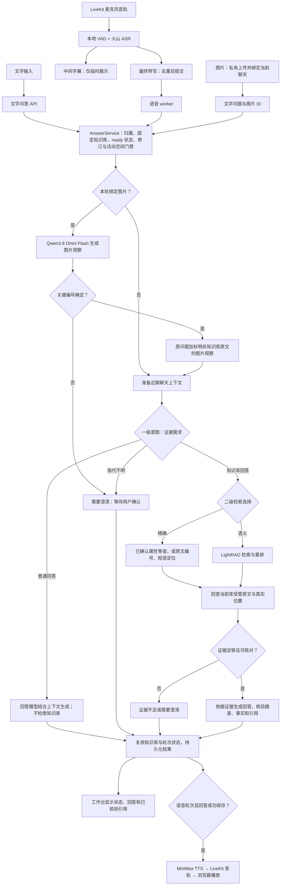

# 文字、语音与图片问答流程（2026-09-29）

三种入口共用 `AnswerService` 的聊天归属、上下文、意图路由、检索、证据核验与持久记录。输入和输出环节各有区别：语音只在 ASR 最终转写后提交正式问题；图片先生成文字观察，图片观察不作为知识库原文或引用。

共同的[Token 预算与批量摘要门禁](CONTEXT-TOKEN-BUDGET-VALIDATION.md)在发送路由、普通回答、知识库回答和摘要模型前计算完整文本请求；图片观察作为当前问题文本一并计入，不把历史摘要当作本轮证据。

## 分流规则与边界

| 路径 | 入口处理 | 是否检索知识库 | 来源 |
|---|---|---|---|
| 文字 | 工作台以 `mode=auto` 提交问题 | 由共用路由决定 | 仅知识库回答且核验成功时展示 |
| 语音 | LiveKit 音频经过 VAD/ASR；中间字幕不入聊天，最终转写进入 `AnswerService` | 与文字使用相同路由 | 回答提交后展示；成功回答才送入 TTS |
| 图片 | 私有图片先由视觉模型生成观察；不确定编号先澄清；确定后把观察文字附于问题 | 由共用路由决定 | 图片观察单独标明，不能冒充知识库引用 |

普通回答没有知识库引用。知识库回答分为精确和语义检索；证据不足时不会自动改用常识回答。聊天固定一个知识库，空库、维护中或待修复库不能直接问答。旧 API 的显式 `semantic`/`exact` 模式仍保留兼容。

这张图描述当前代码接线，不代表真人语音、用户图片识别质量或完整 M1/M2/M3 已验收通过。实现与验收边界参见 [意图路由](INTENT-AND-GROUNDED-ANSWERS.md)、[M2 语音验证](M2-VOICE-VALIDATION.md)和 [M3 图片验证](M3-MULTIMODAL-VALIDATION.md)。
