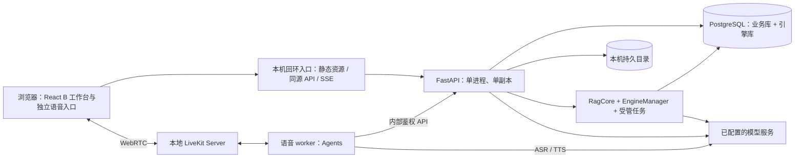

# 多模态知识助手技术选型与架构设计

2026-09-27 M2 架构增量：唯一 API owner 管理正式内存语音会话、租约、绑定与同进程 RTC worker。LiveKit 音轨 → 火山流式 ASR/本地 Silero → 内部 Python 调用既有 AnswerService → 核验与持久提交 → MiniMax TTS/实际音轨输出。worker不创建LightRAG、第二套历史或网络管理入口，现有业务表/schema保持不变。停止/插话实际清队列、取消任务并撤销音轨；维护、revision/workspace、owner或租约失效阻止迟到提交。协议、配置、许可及验证见 [M2 记录](development/M2-VOICE-VALIDATION.md)。以下“语音未来接入”为历史快照，完整 M2 未验收。

本日收尾：一次公开合成语音的真实 ASR/百炼回答与核验/MiniMax TTS/Chrome 播放通过，检索为隔离 PostgreSQL 字面路径，不作为真实 LightRAG 语义检索或真人验收。显式启用助手才允许受控 DPAPI 语音记录补齐缺失配置，环境变量优先，默认关闭不读取；原文下载使用 download 属性，避免 LiveKit 页面离开监听意外断线。请求计数、截图及边界见 [真实供应商验证](development/M2-VOICE-REAL-SUPPLIERS.md)。

版本：v0.1（本地单用户修订）  
更新日期：2026 年 9 月 25 日  
状态：M0 超长输入边界仍未通过；M1-1 已提交，M1-2 至 M1-4 主要本机实现已分层验证；完整 M1 未验收  
产品范围：[本地单用户首版 PRD](多模态知识助手_PRD_v0.2_单企业首版.md)（保留旧文件名）

本文确定首版的技术路线和模块边界。2026-09-27 用户选定 B，正式主入口及独立语音入口采用 React + TypeScript + Vite + Ant Design / Ant Design X；共享主题和现有业务控制器的快照/方法，按页面延迟加载。语音采用官方 LiveKit MIT 欢迎/会话布局，媒体仍由唯一 VoiceController 管理。本轮 A/C 候选移除。后端仍采用 FastAPI + 内嵌 LightRAG SDK + PostgreSQL + LiveKit。一个 API 进程统一管理知识引擎和入库任务；独立语音 worker 复用问答链路属于后续，当前仅本地媒体接入，ASR/TTS/语音助手未实现。详见[迁移说明](development/REACT-UI-MIGRATION.md)。

参考 LiveRAG 的“界面—会话—知识引擎—语音代理”组织方式，保留自己的本地数据归属、会话持久化、资料生命周期和引用验证。首版无需注册、登录或管理员；先完成可重启、可核查、有错误反馈的本地单用户三模态闭环。

当前 M1-2 已接线私有原文、受限解析、持久任务、串行 LightRAG 入库/核验、维护与显式重建；M1-3 已接线查询适配、SDK 规范化到原文位置的唯一映射、逐字摘录、确认属性精确路径、聊天消息/attempt、同聊天近期窗口及 revision/空间失效的持久摘要；M1-4 已接线资料删除/替换、新空间核验切换、旧回答遮蔽、旧空间和原文清理及 blocked 修复。聊天改名/删除、分页和同消息新 attempt 重试也已接线。本轮追加核验并提交后发送的 SSE、断流按持久记录恢复、180 天聊天保留及默认关闭的每日双库加私有文件备份。SSE 尚无模型 token 级首响；恢复后受管库 blocked，须核对快照后删除并显式重建。回答完成前重查 ready、revision、active_workspace；迟到结果丢弃。`CITERAG_INGESTION_ENABLED=false` 和 `CITERAG_ANSWER_ENABLED=false` 默认关闭真实模型调用。`0004`—`0006` 仅在隔离库升级，本轮未读取不可达的实际业务库 schema 或重启旧服务。后文早期“待实现”表述为历史目标。范围与分层证据见 [M1 计划](development/M1-IMPLEMENTATION.md)和 [M1 验证](development/M1-VALIDATION.md)。

2026-09-25 最新实现说明：上段 SSE 缺口是历史快照。回答模型的 SSE 正文片段在生成中先经过原文子串核对，前端标为临时且不显示来源；完整 JSON 及来源经最终校验、ready/revision/active_workspace 门禁与提交后才标 `answered`。中途失败可保存无引用的 `partial` 片段并允许新 attempt 重试；资料变化则遮蔽旧片段。`0007_partial_answers` 只扩展回答状态约束，未迁移实际业务库；真实模型接口尚未调用验证。

## 0 设计边界与关键决定

| 决定 | 本轮采用 | 接受的代价 |
|---|---|---|
| 产品范围 | 本地单用户，自主管理多知识库，无账号或角色 | 不支持局域网共享、远程访问或多用户；未来另行设计 |
| 引擎接入 | FastAPI 进程内封装 LightRAG SDK | API 固定单进程、单副本，不能直接横向扩容 |
| 资料一致性 | 修改时整库维护，取消该库在途回答和通话 | 更新期间该库不可问答；失败保持 blocked |
| 数据存储 | 一个 PostgreSQL 服务，分业务库与引擎库 | 数据库服务仍是单点，需实际备份恢复 |
| 一般检索 | LightRAG naive + 重排；mix 作为对照 | 默认入库仍可能建图，不能按纯向量入库估算成本 |
| 精确检索 | 固定文档属性等值查找 + 范围内原文定位 | 不支持任意字段查询、任意表格统计和实时业务查询 |
| 多模态 | 图片先经 VLM 转为观察，语音先经 ASR 转为文字 | 首版不做图像向量检索，不自建语音大模型 |
| 流式输出 | 正文流 + 应用证据列表 + 保存状态 | 不承诺任意一段临时流在崩溃后都可恢复 |
| 运行方式 | 本机回环服务、显式迁移、停机一致备份 | 不部署服务器，不承诺无停机升级、高可用或自动故障转移 |

本次替代旧稿中的自建中文全文索引/RRF 流水线、完整版本发布系统、通用字段配置器和独立入库 worker。简单化不意味着用内存代替已确认消息和任务记录，也不意味着复制 LiveRAG 中不适合私人会话的共享历史做法。

## 1 技术选型

### 1.1 应用与基础设施

| 层 | 选型 | 首版理由与约束 |
|---|---|---|
| 前端 | React + TypeScript，Vite 构建，pnpm 管理 | 用户授权替代不引入 React 的旧限制；B 正式入口、Ant Design/X 共享主题，沿用现有 API/SSE |
| 前端必要库 | Ant Design、Ant Design X、livekit-client | UI 组件及媒体；ConfigProvider/token 统一主题，X 仅用于 UI，复用现有 API/SSE 而不重写业务链路 |
| 后端 | Python 3.12、FastAPI、Pydantic、uv | 便于接入 LightRAG、模型服务和实时语音组件 |
| 业务持久化 | PostgreSQL 17、SQLAlchemy 2、Alembic、asyncpg | 本地归属、聊天、任务、证据和库状态使用明确事务 |
| 知识引擎 | LightRAG SDK，固定源码提交 | 复用分块、向量化、图构建、检索、重排接入和删除接口 |
| 引擎存储 | PostgreSQL + pgvector 0.8 系列 | 使用 PGKVStorage、PGVectorStorage、PGTableGraphStorage、PGDocStatusStorage |
| 文件解析 | TXT/MD 直接文本解析、pypdf、python-docx | 只支持 PRD 中四类文本文件；解析器在受限子进程运行 |
| 文件保存 | 本机后端持久目录，数据库保存归属及相对存储键 | 首版不单独部署对象存储服务；禁止将上传目录直接公开 |
| 实时语音 | LiveKit Server + Python LiveKit Agents + JS SDK | 负责 WebRTC、音轨、ASR/VAD/TTS 协作与播放控制 |
| 浏览器入口 | 本机回环地址，同源前端/API；开发使用 Vite 代理 | 精确校验 Host/Origin 与请求来源，不信任代理转发身份 |
| 测试 | pytest、Vitest、Playwright | 分别覆盖模块/接口、前端状态和真实浏览器闭环 |
| 运行 | 当前 Windows 本机开发与试用 | API 一个进程一个副本；本地服务安装方式须实测，不引入远程部署 |

版本数字是选定兼容范围，不表示已完成安装验证。M0 生成应用自己的 uv.lock、pnpm-lock.yaml；如后续本地服务使用容器，也固定镜像版本/摘要。升级走兼容测试，不使用漂移的 latest。LiveKit Server、Agents 和 JS SDK 的具体组合及本地运行方式在语音接入验证后一起锁定。

PostgreSQL 的两个数据库建议命名 assistant_app 与 assistant_rag，分别使用业务账号与引擎账号。业务迁移只管理前者，引擎表由固定版本初始化和维护。PGTableGraphStorage 使用普通节点/边表，首版不引入 Neo4j 或 PostgreSQL AGE；迁移引擎存储前仍须完成测试和备份。

### 1.2 模型基线与配置

2026-09-22 用户确认按 LiveRAG 固定提交 `208eede49e76cbb00ed85ee644576bd2520ce8f6` 的默认模型选型准备凭证；CiteRAG 另选 `qwen3-rerank`。2026-09-23 五项百炼模型的受限真实调用已通过，Embedding 实测 1024 维；这不证明双库检索、输入上限或回答质量。语音与图片模型仍在对应阶段验证。申请顺序见 [本地开发：模型服务准备](development/LOCAL-DEVELOPMENT.md#模型服务准备2026-09-22-确认)。

| 用途 | 初始选择 | 约束 |
|---|---|---|
| 最终回答、查询改写 | 阿里云百炼 qwen-flash | 沿用 LiveRAG 的对话模型；文字与语音仍统一经过 AnswerService，优先非思考/低延迟配置 |
| LightRAG 抽取/关键词及引擎 LLM 调用 | 阿里云百炼 qwen-plus | 与最终回答分开计量；检索不是一次 LLM 调用的同义词 |
| 会话摘要 | 阿里云百炼 qwen-max | 沿用 LiveRAG 的 Context Model 选型；仅用于本聊天上下文，功能范围仍按 PRD |
| 文本向量 | text-embedding-v4，实测 1024 维 | 输入上限仍待实测；更换模型/维度需要重建索引 |
| 重排 | 百炼 qwen3-vl-rerank | 当前 M1 仅传文字查询和文字候选；新模型接口结构已用本地 HTTP 替身验证，真实供应商调用尚未授权。图片/视频输入仍待 M3 接线；切换模型本身不使文字资料变成多模态资料。 |
| 图片观察/文字读取 | 待确认；原候选 Qwen3-VL 系列 | LiveRAG 本版未接入 VLM；CiteRAG 图片范围保留，M3 前确认模型，关键编号不确定时让用户确认 |
| ASR | 火山引擎 BigModelSTT，模型配置 bigmodel | 按 LiveRAG 默认流式识别路线；M2 核对服务资源/鉴权、中文、编号及转写稳定性 |
| TTS | MiniMax speech-02-turbo | 按 LiveRAG 默认供应商；M2 实测流式音频、格式、首包和取消能力 |
| VAD | Silero VAD | 在语音 worker 中做语音活动检测；不是完成 ASR 模型训练 |

2026-09-24 切换重排选型为 `qwen3-vl-rerank`。旧 `qwen3-rerank` 独立调用及 LightRAG 双库真实证据保留为历史，不转算新模型的实测。新模型按百炼原生重排路径使用 `input`/`parameters` 和 `output.results`，本机协议测试已覆盖；供应商真实调用及多模态输入链路未验证。当前加密凭证的旧模型元数据不自动改写，需停写备份配置文件后由维护者显式更新；模型配置指纹变化后旧可用报告不能作为新模型可用证明。图片观察模型另在 M3 确认。M0 超长 Embedding 边界仍未通过。LiveRAG 的可选 DashScope TTS 不属于本次默认选择。CiteRAG 的统一回答服务、固定 SDK、PostgreSQL 存储和资料来源规则继续有效。协议见 [百炼重排 API](https://help.aliyun.com/zh/model-studio/text-rerank-api)。

模型适配器统一处理超时、限流、取消和脱敏统计。未输出且可安全重试的幂等请求最多重试一次；已输出的回答不透明重放，重试必须生成新 attempt。不得自动切换到用户未配置的供应商。

用户提供 Key 后只通过本地受控后端配置加载。前端拿不到模型 Key，日志不打印完整请求正文或凭证。不同供应商的数据处理地域需在试用前明确；接入成功不等于质量和隐私条件已验收。

## 2 本地拓扑与核心数据流



RagCore、EngineManager 和受管任务是 API 内的模块，不是额外容器。浏览器入口与 API 仅绑定回环地址；当前开发入口为 Vite。语音 worker 不访问 LightRAG 实例，不直接读写业务数据库或原文文件。语音服务本地媒体连接方式在 M2 实测，不因本地运行而取消 worker 认证与受限房间令牌。

三条输入路径在同一 AnswerService 汇合：

1. 文字：保存输入 → 确认会话/库 → 检索 → 校验证据 → 流式生成 → 保存回答。
2. 语音：麦克风 → LiveKit → VAD/ASR → 最终转写保存 → 同一 AnswerService → TTS → LiveKit 播放；中间字幕不直接触发正式问答。
3. 图片：受控上传 → 归属检查 → VLM 观察/文字提取 → 必要时确认编号 → 同一 AnswerService → 展示正文、观察和文档来源。

入库是另外一条管理路径：上传落盘 → 创建持久任务 → 解析预检 → 进入维护 → LightRAG 写入 → 状态与来源检查 → ready。客户端“上传成功”只表示文件和任务已受理。

## 3 模块职责与工程结构

### 3.1 模块边界

| 模块 | 负责 | 不负责 |
|---|---|---|
| 本地访问与归属边界 | 回环/Host/Origin 校验、服务端本地归属、资源绑定检查 | 登录、账号、角色或多用户体系 |
| KnowledgeService | 库、文档、维护状态、来源和任务编排 | 自写向量/图索引算法 |
| EngineManager | 每库实例、workspace、生命周期、写锁 | 用户会话历史 |
| LightRAGAdapter | 入库、结构化检索、删除、状态查询 | 任意 SQL 工具、用户权限判断 |
| ExactLookupService | 固定属性等值筛选、限定资料原文定位 | 通用查询语言、任意表格理解 |
| AnswerService | 输入归属、上下文、检索路由、证据、回答状态 | 实时媒体编解码 |
| ConversationService | 消息、attempt、摘要、幂等与继续聊天 | 将聊天自动入知识库 |
| ImageService | 私有附件、VLM 观察、字段确认及过期清理 | 图片自动发布到知识库 |
| VoiceBridge | ASR 最终事件、轮次映射、TTS、插话和挂断 | 另一套独立 RAG/聊天真相源 |
| MaintenanceService | 单一写队列、超时清理、停机与恢复检查 | 分布式调度平台 |

所有读写资源的入口先验证本地访问边界、资源归属、库状态和修订号。本地归属由服务端确定，客户端不能切换或提交 owner。内部服务凭证只证明调用方是语音 worker，不能替代对 local_owner_id/conversation_id/voice_session_id 绑定关系的验证。

### 3.2 拟建目录

```text
frontend/
  src/pages/                 工作台、知识库、系统状态
  src/features/chat/         消息、来源、SSE、重连
  src/features/voice/        LiveKit、字幕、播放和停止
  src/features/knowledge/    文档、任务、维护状态
  src/api/                   类型化 API 客户端
  src/state/                 按聊天 ID 管理的明确状态
backend/
  app/api/                   HTTP、SSE、内部语音接口
  app/services/              产品业务与事务
  app/rag/                   EngineManager、LightRAGAdapter
  app/ingestion/             解析、来源映射、受管任务
  app/models/                业务表
  app/providers/             文本、向量、重排、视觉适配器
  app/lifecycle/             启停、维护、恢复检查
  migrations/
voice_worker/
  agent.py
  bridge.py
  providers/
tests/
  integration/
  e2e/
evals/                       问答样本、语音图片样本、评测脚本
scripts/                     本地运行检查、备份/恢复脚本
experiments/                 毕设训练与调优实验
```

前端每个功能导出小范围的初始化/销毁接口。退出聊天、切页或挂断时清理事件监听、音轨和请求；禁止把“当前聊天/当前库”存成跨请求共享的服务端全局变量。内部本地归属是安装级固定标识，不代表当前聊天。允许 API 按库 ID 缓存引擎，这是另一种生命周期。

## 4 业务数据、归属与访问边界

### 4.1 最小业务模型

| 表/实体 | 主要字段或用途 |
|---|---|
| local_profiles | 本地安装的唯一内部归属标识；不是账号，无角色、密码或登录态 |
| knowledge_bases | id、local_owner_id、状态、revision、active_workspace、hide_history_before_revision；创建幂等的 create_request_id/create_request_name |
| documents | kb_id、原文件存储键、哈希、状态、doc_code/model_code/edition、engine_doc_id、source_key |
| parsed_blocks | document_id、顺序、原文、可验证页码/段落、字符范围；不存自研向量 |
| ingestion_jobs | 操作类型、目标文档清单、幂等键、阶段、状态、错误、开始/结束时间 |
| conversations | local_owner_id、kb_id、创建时间、最后用户输入时间、活动 attempt/voice_session |
| messages | conversation_id、角色、输入类型、正文、保存状态、client_message_id |
| answer_attempts | 用户消息、状态、kb_revision、生成文本、持久化边界、错误与播放估计 |
| answer_evidence | attempt_id、doc_id、source_key、chunk/段落标识、实际证据快照、有效性 |
| conversation_summaries | conversation_id、覆盖消息位置、kb_revision、摘要、有效性 |
| attachments、image_observations | 所有者、聊天、哈希、期限、观察及已确认字段 |
| voice_sessions | 本地归属、聊天、房间、控制代次、连接/结束状态 |
| audit_events | 维护、删除、配置变更的脱敏记录 |

以上是逻辑实体，不要求机械地给每个枚举建立一张表。实现时使用外键、唯一约束和必要索引：聊天按 local_owner_id/更新时间分页，消息按 conversation_id/序号读取，文档按 kb_id/固定属性等值查找，任务按状态/创建时间读取。

兼容旧工程：保留 `0001_m0_accounts` 迁移及其中的 users/auth_sessions 数据；追加迁移建立本地归属并扩展库与聊天，旧 owner_id 外键列保留且允许新本地聊天为空。旧账号及业务记录不自动改为本地归属，也不从新接口读取。历史数据迁入另行显式处理，不在应用启动或此次升级时认领。

M1-1 的 `0003_knowledge_management` 追加 nullable 创建请求 UUID/初始名称及 `(local_owner_id, create_request_id)` 唯一约束；旧记录保持 NULL。事务锁定本地归属，先处理重复键再检查 5 库上限；同键不同初始名称拒绝，改名不改创建记录，重放返回当前名称。已使用键存在时拒绝回退。

M1-2 的 `0004_managed_ingestion` 追加 revision/历史遮蔽水位、documents、parsed_blocks 和 ingestion_jobs；活动任务按 kb_id 建部分唯一索引，任务键与库、文档哈希与库分别唯一。M1-3 的 `0005_answer_attempts` 增加 doc_code/model_code/edition、conversation_messages 和 answer_attempts，并用同聊天运行态部分唯一索引保护同时问答；有消息/回答或确认属性时拒绝 downgrade。`0006_m1_lifecycle` 追加 revision/空间绑定摘要，扩大资料及任务状态，并以未删除资料部分唯一索引代替全量唯一约束；有摘要、删除/替换或清理历史时拒绝降级。

client_message_id 在本地归属/会话范围唯一；文档的来源键由服务端生成。编号属性按字符串保存，保留前导零、连字符、大小写和型号后缀；若某业务需要额外归一化，必须定义独立规则和反例，不能全局把 001 转成 1。

### 4.2 三种隔离

- 知识库隔离：每库独立 LightRAG workspace 和 working_dir；所有解析记录、来源、任务和检索都带 kb_id。
- 本地归属与会话隔离：库、聊天、消息、摘要、图片、回答证据和语音房间必须校验 local_owner_id 及关联关系；历史未归属资料不可读，不把同一库的聊天上下文混在一起。
- 运行隔离：同一聊天一次活动回答、一个语音控制端；同一库的修改互斥；本地安装同一时间只执行一个入库/修改任务。

内部本地归属不是不同操作系统使用者之间的安全隔离；能访问本机文件或数据库的人员仍可能读取资料。首版不设计动态文档 ACL，不引入 tenant_id、账号角色或空壳多用户架构。

### 4.3 本地请求与文件入口

应用不提供登录 Cookie、密码或管理员初始化。API 仅绑定回环地址，启动时不信任代理头（Uvicorn 使用 `--no-proxy-headers`），校验连接来源、Host、精确 Origin 和跨站请求。拒绝 `Forwarded`/`X-Forwarded-*`，不接受代理声称的本地身份；开发代理不添加此类头。允许本地 HTTP，不将这一配置用于局域网或公网发布。

原文、图片和引用通过业务 API 取回，每次重新检查本地归属、聊天/库绑定与当前可见性；静态服务不公开持久目录。上传检查真实类型、体积和图片像素，限制解析时间/内存，拒绝路径穿越和 DOCX 解压膨胀。Markdown/模型文本经过清理，文档中的命令不执行，首版没有模型任意调用 SQL/网络工具的能力。

## 5 LightRAG 接入、入库与维护

### 5.1 固定版本及实例所有权

本地基线是 LightRAG 源码提交 **59af311307c7417b342f44850b097648d47e83bd**，版本文件报告 **1.5.8 / API 0347**。依赖需固定该提交及其解析后的锁文件；不能仅写版本号，就假定 PyPI 同名版本与该源码完全相同。

LiveRAG 本地提交为 208eede49e76cbb00ed85ee644576bd2520ce8f6，其锁文件使用 LightRAG 1.4.16。借鉴模块思路，不跨版本照抄参数或初始化代码。

EngineManager 的规则：

1. API 固定 workers=1、单副本，在一个事件循环管理所有引擎；语音 worker 不创建引擎。
2. 服务端生成库 UUID，初始 workspace 使用 kb_加无连字符 UUID，重建使用带随机后缀的独立空间。生产 `RagRuntime.get` 每次读取业务库 active_workspace，并交 EngineManager 选择实例/独立目录；读取失败不回退到由 UUID 推导的旧空间。候选空间只能由内部维护入口使用，浏览器不能指定空间或路径。
3. 配置里禁止非空的全局 POSTGRES_WORKSPACE，以及 config.ini 中覆盖实例的 workspace；检测到时启动失败，避免不同库被实际写进同一空间。
4. 创建实例后调用 initialize_storages()；当前固定版本会初始化相应 pipeline 状态。按该版本生命周期初始化共享设施，关闭时调用 finalize_storages()，不混用早期版本示例。
5. 专用 PostgreSQL 连接持有全应用 owner advisory lock，阻止第二个 API 启动。连接/锁丢失时停止受理与输出并退出；接管前必须确认旧进程结束。数据库锁不能隔空阻止旧 SDK 已发出的请求，不能当作自动主备切换。
6. 单一受管任务队列串行执行引擎变更，业务 jobs 表记录真相。普通解析移到受限子进程，避免阻塞实时请求的事件循环。

这里选择嵌入 SDK 是首版减少服务数量的设计取舍。若未来需要多 API 副本，再把 RagCore 提升为独立服务，并重新解决实例所有权和任务并发；不能直接把 Uvicorn worker 数量改大。

### 5.2 上传、解析和分块

上传文件先写临时路径，完成校验和可靠落盘后再以业务事务保存文件引用及 queued 任务；临时文件用服务端存储键。写盘失败不返回受理成功，数据库提交失败的孤立文件由清理任务处理。在目标本机系统验证文件刷新与原子重命名流程；持久目录实际备份见第 9 章。

应用先解析 TXT、MD、文字 PDF、普通 DOCX，保存有序 parsed_blocks，并生成交给引擎的确定性正文。PDF 页面、DOCX 段落/简单表格位置只有在解析可靠时保留。预检不通过的文件保持失败，不影响已经就绪库的索引；进入引擎修改后失败则按维护失败处理。

M1-2 实现：`.local/runtime/sources/` 使用随机存储键、SHA-256、文件 fsync 与原子重命名，最多 5 份/批、20 MiB/份；无静态原文目录。解析子进程先启用 Windows JobObject 或 POSIX resource 限制，再加载 pypdf/python-docx：20 秒、384 MiB、500 万字符/5 万块，PDF 最多 100 页。DOCX ZIP 单成员 20 MiB、总解压 80 MiB，超过 1 MiB 成员压缩比不超过 100:1；拒绝路径穿越、合并/嵌套表格、嵌入对象、字段、修订和非空页眉页脚等不可靠结构。

定位使用 1-based 实际行/页/段落/表格行及规范正文半开字符区间，解析块不冒充引擎片段。锁定 pypdf 6.19.0、python-docx 1.2.0、python-multipart 0.0.32。解析资源约束不是任意代码执行沙箱；存储保护不承诺隔离同一 OS 用户。

同库原始 SHA-256 重复在受理前拒绝；引擎规范化后正文等价也在进入修改前拒绝，防止 SDK 全局内容片段键合并不同原文来源。上传事务结果不确定时保守留存原文；启动 owner 独占下核对全部数据库引用，只清理超过 24 小时未引用的受管 `.source/.partial`，保留已提交、近期及非受管文件。

调用固定版本公开入口：

```python
# 接口示意；权限、维护门禁、存储和模型初始化由外层完成。
track_id = await rag.ainsert(
    input=normalized_text,
    ids=engine_doc_id,
    file_paths=source_key,
    track_id=job_id,
)
```

file_paths 是来源标识，ainsert 不会因此读取文件。源文本入口显式设置 chunk_token_size=1200、chunk_overlap_token_size=100，使用该 SDK 的固定 token 策略。不要把自有 parsed_blocks 等同于引擎 chunks，它们分别承担原文定位和引擎索引职责。

末块/短文本可以小于 1200；重叠不保证语义完整。保留问题集中的跨段条件、数字单位和否定条件测试。引擎分块 tokenizer 与目标模型 tokenizer 可能不同，入库前验证 Embedding 输入限制，生成前用目标模型预算再次检查，不允许供应商静默截断导致资料不完整。

P0 不使用已 deprecated 的 ainsert_custom_chunks；不把这个追加式接口当作安全替换。P1 再用该固定版本支持的其他正式入库策略做段落/递归切分对照，接口和更新行为重新测试。

普通入库会调用模型抽取实体关系并建立图数据。naive 只选择查询模式，不能据此宣称入库没有图谱成本。当前源码虽有跳过抽取的 pipeline 选项，P0 不另开这一配置分支；首先计量默认入库耗时、模型请求与空间占用。

### 5.3 受管任务与库级维护

M1-2 业务任务状态为 queued/running/succeeded/failed/interrupted，阶段为 accepted/parsing/parsed/indexing/verifying/complete。一个上传任务最多 5 份文件，每份独立状态和来源映射。API 内单一受管循环串行修改引擎，PostgreSQL 为进度真相。默认 `CITERAG_INGESTION_ENABLED=false`，解析结果提交后 queued/parsed 等待；启用会发送资料给模型，需对应授权，不能因旧报告 available 自动开启。

资料变更统一流程：

1. 上传及解析预检完成，保存本次操作清单；管理页面明确维护和历史遮蔽影响。
2. 业务事务把库改为 maintaining，revision 加一，作废旧摘要；删除/替换/不确定重建同时设置旧知识回答的遮蔽水位。此后拒绝新文字、语音、图片及精确查询。
3. 取消该库正在执行的查询/生成，结束该库通话并停止播放；等待受管任务结束或确认隔离。未能可靠停止时保持维护，不继续写入。
4. 执行入库、删除或替换；不假设业务库与引擎多种存储处在一个事务中。
5. 按操作核验：入库/替换的新文档应为 PROCESSED；删除的文档及对应派生数据应已清理，剩余有效资料状态正常。核对源清单、来源映射，并对非空库做小规模实际检索检查。ainsert 返回 track_id 不等于成功。
6. 全部通过后完成任务、恢复 ready；有效文档数为零时回到 empty。失败、超时或进程中断进入 blocked，明确展示失败阶段。

M1-3 AnswerService 已在提交回答前重新核对 ready、revision、active_workspace 和运行态 attempt，阻断维护前取回的迟到证据。M1-2 原文/解析块已在读前及异步读取后重新查库状态；回答 SSE、通话及更多并行场景仍待对应切片实现/验证。

启动时把未正常结束的引擎变更任务和关联库标成待恢复/blocked；不能仅凭 pipeline 不忙就恢复 ready，也不盲目重跑所有 running 任务。使用者根据原操作清单和引擎实际状态重试；无法证明一致时从现存源文件清单重建。

### 5.4 删除、替换、修复

删除先撤销业务访问，再调用 adelete_by_doc_id(doc_id, delete_llm_cache=True)，显式清理关联抽取缓存。检查 DeletionResult 的状态以及文档状态、片段、向量、图关联和相关缓存实际残留；该接口可以返回 status="fail" 而不抛异常，不能仅以调用返回认定成功。替换采用维护期内删除旧内容、写入新内容；中途失败保持 blocked，不能承诺自动回退到旧索引或旧答案。

同库相同内容通过哈希提示重复；文件名不是唯一 ID。引擎 ID 与业务文档、来源键显式对应，重试先查已存在状态，不依赖随机新 ID 绕过错误。

重建采用“维护期间，新建独立 workspace，从确认的有效原文重建，验证后更新 active_workspace”的修复办法。全过程停查，不提供在线双版本发布、用户选版或回滚页面。旧 workspace 永久退出查询路径，再按清单清理全部派生数据；清理失败必须单独可见，涉及删除未完成时保持 blocked。

M1-1 曾发现引擎只按 UUID 推导空间；M1-2 已修复生产读取路径，并在隔离 PostgreSQL 验证新空间成功切换及应用重启后 resolver 仍选数据库 active_workspace。核验失败不切换，库保持 blocked；过期重建任务以 stale_job 拒绝，旧上传任务不得写回退出空间。旧空间当前隔离保留并显示 cleanup_pending，物理清理和删除/替换仍由 M1-4 完成，不能宣称已删除旧派生数据。

清理按明确的库/空间清单执行，禁止笼统删除整个引擎数据库。已经废弃的空间不能在重启或备份恢复时被自动重新选中。

## 6 检索、精确定位与回答

### 6.1 一般语义路径

AnswerService 先加载本会话可用上下文，将“它/刚才那个”等改写成独立查询；只使用本会话已确认信息。对象不明确则澄清。不能假设把 conversation_history 传给 LightRAG 就自动完成会话感知的检索改写。

LightRAGAdapter 使用结构化查询接口：

```python
result = await rag.aquery_data(
    query=standalone_query,
    param=QueryParam(
        mode="naive",
        chunk_top_k=8,
        max_total_tokens=4000,
        enable_rerank=True,
    ),
)
```

这里的候选数和预算是初始调优值。aquery_data 返回检索数据，不生成产品最终回答；应用统一用 AnswerService 生成文字及语音所需文本。必须配置真实的 rerank_model_func，验证接收候选、排序及 index/relevance_score 适配；只有 enable_rerank 开关不能证明重排已发生。

P0 默认文字和语音使用同一 naive 路径，不为了实时性悄悄减少证据或跳过重排。mix 在固定样本上比较质量、延迟和成本后决定是否启用；它不是我们旧稿“中文 FTS + 向量 + RRF”的替代名称。

检索失败与无证据分别返回错误或不足状态。固定 SDK 可能在重排异常、空结果或无效结果时退回原候选；Adapter 必须按请求记录重排的调用、输入数量、结果校验和成功状态，在 aquery_data 返回后检查，不能只捕获异常。确实没有召回候选时允许不调用重排；已有候选却未成功重排时，首版提示重试，后续若引入降级必须标明。跟踪信息不能放在跨请求共享的单一变量中。实体/关系检索的支持能力不等于其所有结果都可直接作为可信事实。

### 6.2 有限精确路径

本地 QueryParam 没有任意 doc_ids 集合或 metadata 硬过滤参数，因此不设计不存在的“传文档白名单给 LightRAG”能力。精确路径直接使用应用自己的 document/parsed_blocks：

1. 从用户输入提取候选属性，按服务器允许的 doc_code、model_code、edition 校验；含歧义或视觉识别不确定的值先确认。
2. 在当前 kb_id 内以参数化等值 SQL 筛选文档；文档属性由使用者确认，缺属性不能假装覆盖。
3. 确定唯一资料或明确的小集合后，正文在预算内可整体取证；超过预算只对用户明确给出的完整编号/短语做范围内字面定位，取包含条件的关联段落。
4. 字面匹配采用已定义的标识符边界规则，防止 A001 命中 A0010；保留 001、X100 Pro 等原值。按顺序展示多个候选，不在不同记录间拼接事实。
5. 无匹配、缺少定位词、结果过多或上下文不足时澄清/说明限制，不回退成全库 Top-K 后过滤。
6. 证据进入与普通查询相同的来源检查和回答模块，仍受 maintaining/blocked、revision 和会话归属约束。

初期数据规模允许在已筛出的单份或少量资料内扫描解析块；必须设置字符量/候选数/超时上限。上限具体值由 M1 实测确定，超限转澄清，不假装全量查完。对编号使用 LIKE '%...%' 只能生成候选，不能充当最终精确判定。

订单数据库、ERP/CRM、SQL 聚合、任意 XLSX 字段问答属于后续连接器。对“我的订单状态”不猜用户身份，也不从历史聊天推断订单权限。

### 6.3 来源契约与输出状态

应用内部 EvidenceSet 至少含：evidence_id、kb_id、kb_revision、doc_id、source_key、chunk_id 或 parsed_block_id、实际证据正文、可验证定位。前端只接收经授权的来源标识和应用 URL，不直接使用引擎 file_path 当公网链接。

检索返回的 chunk 有 content/file_path/chunk_id/reference_id 等字段，但不能假设自带 full_doc_id 或页码。file_path 使用写入时的唯一 source_key，通过本库映射查回文档；无法唯一映射、已失效或不属于当前库的片段不得用于回答。页码通过解析文本范围匹配取得，匹配不可靠则仅展示来源片段。

最终响应结构由应用维护：

```text
attempt_id, status, text, citations[], kb_revision,
input_type, saved_through, error_code?
```

status 为 answered / needs_clarification / insufficient_evidence / conflicting_evidence / failed / partial。流中发送正文增量、来源、状态及保存进度事件，不要求模型逐 token 生成合法业务 JSON。

模型只能引用本轮 evidence_id。应用验证编号和来源有效性，未通过的引用不渲染成可点链接；来源存在不等于内容必然正确，关键事实和矛盾仍需用评测集检验。图片观察单独标记，不冒充知识文件引用。

回答生成使用近期上下文 + 当前问题 + 本轮证据。明确证据是资料内容，不是系统指令；没有证据时不让模型补写编号、价格、条件或状态。

2026-09-26 当前实现扩展：自动路由增加 `chat` / `general`，与既有 `semantic` / `exact` / `literal` / 澄清 / 不支持共用固定知识库和就绪门禁。路由的 JSON 可包含有长度限制的语义或通用问题改写；近期窗口附加由已保存路由产生的 `answer_kind`，协助跟随最新话题，历史与文件名仅用于意图和指代。通用回答只发送独立问题，不发送证据正文，不生成知识库引用；UI 明确其依据类型。未引入额外 Agent 框架或数据库迁移。

知识库回答模型输出 `status`、`text`、`evidence_ids` 和 `support[{evidence_id,quote}]`。后端先检查本轮编号、逐字摘录和实际原文网址，再让 `qwen-flash` 对概括正文及引用证据进行独立事实支持核验，只有严格布尔 `supported=true` 才进入原 revision/workspace/ready 提交门禁；拒绝与故障都保留具体安全错误码。旧无 `support` 的输出只兼容逐字摘录，不构成总结绕过入口。新总结的 SSE 内容先缓冲，核验并保存后输出 `saved=true` 增量和正式引用；保持前端原 partial 重试守卫。回答单次预算最多 2048 Token、通用回答 1024、路由 384、支持核验 128；入库与历史摘要的供应商输出上限仍为 512。独立模型核验增加请求和延迟，同模型的相关性错误仍须真实评测，不承诺零幻觉。

## 7 会话持久化、上下文与接口

### 7.1 提交、流式与重试

用户输入提交必须在业务事务成功后返回 accepted/message_id；重复 client_message_id 返回既有结果。事务同时检查本地归属、会话、库可用性和活动轮次约束，防止两个标签页同时启动回答。

每次生成建立独立 answer_attempt，区分 running/completed/interrupted/failed。用户点击重试创建新 attempt，不覆盖原始用户消息。聊天记录保留错误和中断状态；最终 saved 事件必须晚于数据库提交。

文字增量可以临时显示，界面显示“生成中/尚未保存尾部”。服务端按完整句或短时间间隔持久化检查点，发出 saved_through；异常后只恢复已保存边界，临时尾部明确标为中断。语音需先保存可播放的句段再交 TTS，避免已播大量内容却完全没有记录。

一个 attempt 的结束回调只可更新自身，并以比较当前 attempt_id 的方式释放活动位置；不能由旧请求结束事件清掉新轮次。数据库不可写时停止继续承诺保存，暂停新轮次并给出可重试错误。

### 7.2 上下文预算与失效

完整消息保存在 PostgreSQL，每轮只选择本聊天的近期窗口和有效摘要。初始最多取最近 10 轮，在目标模型 tokenizer 下以总输入 12,000 token 为上限，其中证据目标最多 4,000；输出先设 1,500。实际模型更小则取更小预算，编号/条件不能截掉后仍当作完整证据。

摘要在超预算后生成，目标不超过 1,000 token，记录覆盖位置和 kb_revision。摘要失败保留原文、使用可容纳的近期窗口，必要时提示重新明确对象；不把失败摘要写成空内容覆盖有效记录。

每次知识库内容维护递增 revision：旧知识回答不再作为当前事实输入，旧摘要失效，重新检索。新增资料后的旧回答仍可历史展示；删除/替换/不确定重建则按 PRD 的库级水位遮蔽旧知识回答正文和证据，不假装做到了精确逐句追踪。

用户原始问题保留，但其中引用的旧助手结论不能被自动提升为事实。图片过期时删除派生观察、遮蔽对应派生内容并使相关摘要失效，避免已删图片通过摘要继续传播。

### 7.3 接口草案

| 接口 | 用途/要求 |
|---|---|
| GET /api/health、GET /api/status | 进程存活及本地模式分项能力状态；无数据库也明确返回未配置 |
| /api/knowledge-bases | 本地归属下全部库的列表、创建、改名；无角色区分 |
| /api/knowledge-bases/{id}/documents | 上传/列表；替换、删除转为持久维护任务 |
| /api/jobs/{id}、/retry；/api/knowledge-bases/{id}/rebuild | 状态、重试、修复；必须检查本地归属和任务状态 |
| /api/conversations | 本人聊天创建、分页、读取、删除 |
| POST /api/conversations/{id}/messages | 文字/图片输入；幂等键与固定 kb_id |
| GET /api/conversations/{id}/events | SSE，发送 attempt、seq 和保存状态 |
| POST /api/attempts/{id}/cancel、/retry | 显式取消/重试；本人 |
| /api/attachments；/api/evidence/{id} | 私有图片、原文和证据读取，复核状态 |
| POST /api/conversations/{id}/voice-session | 校验后创建房间绑定和短期受限令牌 |
| /api/voice-sessions/{id}/end、/transcript-correction | 结束通话或纠正当前轮次 |
| /internal/voice/* | worker 提交最终转写、取回答流、取消、报播放进度 |

此表是完整闭环接口草案；当前 M1-1/M1-2/M1-3 实际入口见 [后端说明](../backend/README.md)，不要把后续 SSE/语音草案当成已实现。旧 `/api/auth/*`、`/api/me`、`/api/admin/*` 和管理员初始化 CLI 已退出当前契约，不增加公开注册。

统一错误语义包括 forbidden、kb_maintaining、kb_blocked、turn_conflict、capacity_exceeded、provider_timeout、persistence_failed；不得都用“没有找到答案”。

SSE 是实时展示通道，数据库是恢复依据。单进程下先注册事件订阅再读取持久快照，按序号去重并处理窗口内事件；掉线后以保存边界重新读取，不把漏掉的临时 delta 当作已保存。P0 不建设跨进程事件回放系统，重连也不自动重新生成回答。

## 8 实时语音、打断与图片

### 8.1 音频职责划分

| 环节 | 负责方 | 说明 |
|---|---|---|
| 采集、回声消除/降噪 | 浏览器音频约束及其实际实现 | 检查设备支持，不保证所有系统效果一致 |
| 网络媒体传输 | LiveKit/WebRTC | 媒体与普通 REST/SSE 分开 |
| 采样率/格式转换 | worker 的 ASR/TTS 适配器 | 与供应商协议一致，避免重复重采样 |
| 语音活动/端点 | Silero VAD + ASR 最终结果 | 结合参数评测，不能只靠静音时长保证语义完整 |
| 识别 | 云流式 ASR | 中间结果做字幕，最终结果去重提交 |
| 检索和生成 | API AnswerService | 与文字共用证据规则与持久化 |
| 合成和播放 | TTS 适配器 + LiveKit | 按可读句段合成，保留数字、单位和否定条件 |

语音 Agent 的标准自动回复流程需要显式接入 VoiceBridge；不得一边调用应用生成，一边让默认 LLM 插件再次自行回答。LiveKit 的内存聊天状态只用于实时控制，不作为产品持久历史。

### 8.2 打断的完整链路

每个房间绑定 local_owner_id/conversation_id/kb_id，每轮使用 API 生成的 attempt_id；重连/换控制端增加控制代次。后端验证 worker 回调仍属于当前绑定。

检测插话或用户按停止后：立即中断当前播放及本地/服务端待播缓冲 → 通知 API 取消旧 attempt → 取消检索/LLM/TTS 可取消任务 → 提交新一轮最终转写。迟到的旧文本、合成结果和回调按 attempt/控制代次丢弃。

代次编号只解决应用事件归属，不能自动清掉已经进入音轨的音频。因此必须调用 SDK 的中断/清空播放能力，并在实际浏览器测试音频停止；不能只设置一个 cancelled 布尔值就声称实现打断。P0 关闭假打断后的自动续播，取消后的旧 attempt 不复活；SDK 配置路径按选定版本核验，行为依据见 [LiveKit 官方说明](https://docs.livekit.io/agents/logic/turns/)。

日志分别记录生成文本、已提交 TTS 文本、播放位置估计及估计来源；播放估计不等于用户实际听见。被取消尾部不作为已讲完的上下文。假打断、漏打断、远端缓冲和网络断开都要纳入 M2 测试。

通话期间固定当前聊天和库，新增文字/图片先挂断；转写纠错经专门接口取消旧 attempt 并建立修正后的轮次。断线重新申请受限房间访问并读取已保存记录，不自动续播旧缓冲；TTS 故障保留文字并提供文字降级。

### 8.3 图片流程

每条最多 2 张 PNG/JPEG、每张 10 MB，上传时检查解码后像素和资源限制。图片与本地归属/聊天绑定，VLM 输出保存为“观察”，同时记录模型配置和确认状态。

视觉模型提取的型号/序列号若低置信或存在多候选，进入澄清，不直接拿猜测编号精确查库。确认后的文字可进入第 6 章的相同检索流程。图片本身和观察不自动入知识库。

图片上传起 30 天到期，且不超过聊天期限；未提交附件 24 小时清理。VLM 失败明确显示失败并允许补充文字；不改成空观察后继续宣称看懂图片。

### 8.4 延迟与并发

初始限制：同一本地安装 1 路活动语音、2 路文字/图片生成、1 个引擎变更任务；用于控制同一使用者的多标签页，不表示多用户支持。语音预留自己的生成位置；同一聊天仍只能有一个活动轮次。限额由唯一 API owner 控制并与持久状态核对，不由多个 worker 各自计算。API 重启恢复时先失效旧会话的控制代次，结束旧会话并关闭对应房间/参与者，确认停止后才释放名额；失败则暂停接纳新语音。worker 失去内部 API 连接后须在配置的有界超时内停止生成和播放，不独立继续服务。

记录客户端提交/语音结束、ASR 最终结果、检索开始结束、重排、LLM 首事实文本、TTS 首包、浏览器首次播放及停止播放时间。跨端使用受控追踪 ID 和各端单调耗时，避免直接相减未同步时钟。

文字/语音有事实首响 P95 ≤5 秒、插话停止 P95 ≤800 毫秒是工程目标。提示音或“正在查询”单独统计，不能代替事实首响。优先减少重复模型调用、正确流式衔接和限制并发；不得通过跳过必要证据把错误答案变快。

## 9 本地运行、保留与恢复

### 9.1 服务、配置和资源

当前在本机分别启动 Vite、API 和 PostgreSQL；M2 再接入本地 LiveKit 与 voice worker。所有浏览器入口仅绑定回环地址。前端构建产物的本地提供方式在试用前确定；原文、图片、引擎工作目录与 PostgreSQL 数据均使用明确持久目录，不放临时目录或容器临时层。

以用户现有本机为验收对象，记录 CPU、内存、剩余磁盘和模型网络条件，根据文档、图规模和真实语音负载确定可接纳容量，不提出未经实测的硬件采购要求。模型可通过配置的云接口调用；毕业训练算力单独评估。

本机业务 HTTP 可用不等于媒体能通。M2 需在真实浏览器验证回环页面的麦克风权限、LiveKit 信令、媒体端口和停止播放；本地 LiveKit 的运行方式及平台兼容性届时固定。公网地址、域名和 TURN 公网部署不是首版前置条件；数据库、内部语音 API 及媒体服务不得因此开放公网。

本地安装级配置包含模型用途/区域、Embedding 维度、文件限额、上下文预算、并发、超时、保留期和路径。只读状态页展示脱敏结果，在线编辑模型配置放 P1。启动检查 owner 锁、workspace 覆盖项、迁移版本、持久目录和模型适配配置。无数据库时允许打开工作台查看未配置状态，但业务数据接口不可伪报可用。

容量候选与 PRD 一致：1 个本地使用者、5 库、同一安装最多 100 文档或 10,000 引擎片段，任何上限先到即限制新增；实体、关系、原文、图片和日志另受磁盘水位限制。解析预估和入库后实测数量都要检查，超额不能开放该批资料，需清理/修复后恢复。

### 9.2 保存期限与删除

| 数据 | 保存/停止访问规则 |
|---|---|
| 文档与派生索引 | 保留至主动删除；先禁用访问，在线物理清理目标 24 小时，失败 blocked |
| 聊天、证据、摘要 | 最后已保存用户输入起 180 天；空聊天按创建时间 |
| 图片、视觉观察 | 上传起 30 天且不超过聊天；孤立临时附件 24 小时 |
| 原始通话音频 | 默认不保存，不自动进入训练数据 |
| 诊断日志/操作审计 | 30 天/180 天，脱敏并轮转 |
| 应用运行期间每日备份 | 滚动 7 天；错过计划下次启动补做，不承诺即时擦除备份 |

清理工作由 API 的受管维护任务按期限扫描，过期资源先在读取时立即拒绝，不能等待夜间任务才失效。需要修改引擎时仍使用同一维护流程。清理失败有可见任务和重试入口，不静默吞异常。

### 9.3 停机一致备份和恢复

备份先进入系统维护，停止新问答/上传，结束通话，等待引擎写任务终止并确认没有写入者，再备份业务数据库、完整引擎数据库、源文件/附件以及非密钥配置和版本清单。两库分别导出也必须处在同一无写入窗口，不能只备份向量表。

备份至少另存一份到不同故障域，具体目的地由用户提供。备份介质包含用户资料，限制访问并加密；密钥通过独立安全方式恢复，不随业务备份明文打包。

恢复默认维护状态：校验版本和文件清单 → 恢复两库及文件 → 处理未完成任务 → 核对最新删除记录及本地归属 → 用两个库实际问答、打开引用、恢复本人聊天 → 验证通过再开放。

删除动作保留独立追加记录并定期同步到备份位置，用于避免旧备份重新开放已删除资料。这不是无损灾备日志；灾难后无法确认记录是否最新时，保持维护并人工核实，不自动开放旧快照。旧账号数据恢复后仍不自动认领为本地资料。

至少进行一次空环境恢复。备份可能丢失最近一次成功备份后的资料；应用未运行期间不能声称每日备份已执行。本地单机不承诺自动切换、99.9% 或 15 分钟 RPO。API 重启恢复业务不等于故障机器完全丢失时数据零丢失。

## 10 实施、验证与后续扩展

### 10.1 阶段与通过条件

| 阶段 | 工作 | 必须先验证的风险 |
|---|---|---|
| M0 接入基线 | 原生 TS 工程、本地归属、回环边界、PostgreSQL、固定 LightRAG、模型适配 | 无登录、旧数据保留隔离、PG 四类存储、两 workspace、实例生命周期、向量维度和真实重排 |
| M1 文字闭环 | 文件上传、维护入库、一般/精确问答、来源、聊天保存 | 真实检索、编号边界、幂等、重启、删除与失败修复 |
| M2 语音 | LiveKit、ASR、API 桥接、TTS、插话 | 只有一套回答生成；旧音频不复活；转写去重与降级 |
| M3 图片 | 私人附件、VLM、关键字段确认、统一检索 | 图片归属、过期派生清理、模糊编号不误查 |
| M4 本地试用 | 目标本机、混合负载、备份恢复和评测报告 | PRD 全部 AT-01 至 AT-15 通过，边界真实可见 |

M0 工程、五模型及真实 LightRAG 双库证据沿用；超长 Embedding 输入边界仍暂缓未通过，M0 未完成。用户授权推进 M1-2，当前实现已通过本机验证，完整 M1 未验收。新 SDK 验证采用真实隔离 PostgreSQL＋本地模型替身，不冒充供应商验证。结果见 [M0 验证](development/M0-VALIDATION.md)、[M1 验证](development/M1-VALIDATION.md)和 [交接](development/HANDOFF.md)；旧提交 CI 不覆盖新增改动，新提交结果以对应 CI 运行记录为准。

### 10.2 测试和评测重点

- 引擎契约：真实调用 ainsert/aquery_data/删除/状态；坏模型、部分写入、重启及失败恢复；不能用 mock 通过代替与所选 PG 后端联调。
- 隔离：同名文档、相似内容、跨库相同编号；全局 workspace 覆盖必须被启动检查拒绝；篡改聊天/图片/引用/房间绑定均被拒绝；旧账号资料不自动可读；远端、错误 Host/Origin 与伪造代理请求被拒绝。
- 生命周期：维护与并发查询交错、删除/替换失败、旧输出迟到、新旧 attempt 回调交错、二个 API 争 owner、数据库连接丢失。
- 精确边界：001/1、A001/A0010、X100/X100 Pro、缺属性、多结果、字面跨段、超预算、无匹配及不支持的统计。
- 保存与恢复：用户 accepted 前后故障、临时正文尾部、SSE 断开窗口、摘要失败、附件过期、删除水位、应用重启和空环境恢复。
- 媒体：真实麦克风、弱网、回声、短暂停顿、插话、假打断、TTS 失败、挂断/重连、停止播放延迟。

初始样本为 40 道问答（15 语义、10 精确、10 无答案、5 变更/冲突）、20 段语音、10 张图片和 20 个归属/输入安全反例。开发与验收样本分开。固定规则反例全部通过，关键事实正确率 ≥90%，无答案 10 题全不编造，同时报告可回答题误拒答率 ≤10%。

在目标本机、真实模型、候选数据量和规定混合负载下至少测 50 次文字、50 次语音。有事实首响和打断达到第 8 章目标，限额内成功率 ≥95%，超时和异常必须计入分母；拒绝超额负载单独报告。质量不达标不能只展示更快的耗时。

### 10.3 明确后移的工作

P1 再评估结构分块、复杂 DOCX/扫描 PDF/XLSX、独立 OCR、mix 和图谱效果、更多固定属性/业务连接器、对象存储、独立 RAG 服务及更高并发。在线发布/回滚、租户和文档级权限必须在真实需要出现后单独设计迁移，不靠预留字段宣称完成。

未来如需多用户或多企业，必须重新设计账号归属、认证、业务查询、workspace、文件、缓存、任务、语音房间、聊天、备份和模型配置；本地单用户模式不能直接开放为网络共享服务，也不预先实现注册或账号管理。

毕设 experiments 独立完成合法数据、音频预处理、特征提取、训练/微调、评测和复现记录。云 ASR 和 LightRAG 消融能作为基线及工程实验，但不能替代任务书要求的模型训练；训练对象需导师认可。

## 11 依据、版本证据与修订记录

引擎接口以本地固定提交源码、M0 已有真实双库证据及本片隔离库验证为依据；本片新增验证使用本地模型替身，未新增真实供应商请求，未部署。官方文档用于理解组件职责，后续版本变化不自动修改本基线；本地单用户行为以最新计划和实际测试记录为准。

| 来源 | 本轮使用的依据 |
|---|---|
| [LiveRAG 架构说明](https://github.com/YS-BW/LiveRAG/blob/208eede49e76cbb00ed85ee644576bd2520ce8f6/docs/ARCHITECTURE.md) | 语音、会话和知识引擎的组织；部分入口历史清理行为不能直接照搬 |
| [LiveRAG EngineManager](https://github.com/YS-BW/LiveRAG/blob/208eede49e76cbb00ed85ee644576bd2520ce8f6/liverag/rag/engine_manager.py) | 按 kb_id 缓存实例，独立 workspace/目录 |
| [LiveRAG 锁文件](https://github.com/YS-BW/LiveRAG/blob/208eede49e76cbb00ed85ee644576bd2520ce8f6/uv.lock) | 与本轮 LightRAG 版本存在差异，不能盲拷代码 |
| [LightRAG 版本](https://github.com/HKUDS/LightRAG/blob/59af311307c7417b342f44850b097648d47e83bd/lightrag/_version.py) | 1.5.8，API 0347 |
| [LightRAG 核心接口](https://github.com/HKUDS/LightRAG/blob/59af311307c7417b342f44850b097648d47e83bd/lightrag/lightrag.py) | initialize_storages 约 1986 行；ainsert 2310 行；aquery_data 4901 行；adelete_by_doc_id 6727 行 |
| [QueryParam 定义](https://github.com/HKUDS/LightRAG/blob/59af311307c7417b342f44850b097648d47e83bd/lightrag/base.py) | 90 行起；无任意文档集合硬过滤参数，历史不等于检索改写 |
| [PG 图表存储](https://github.com/HKUDS/LightRAG/blob/59af311307c7417b342f44850b097648d47e83bd/lightrag/kg/pgtable_impl.py) | 普通 PostgreSQL 图表、全局 workspace 覆盖规则 |
| [Pipeline](https://github.com/HKUDS/LightRAG/blob/59af311307c7417b342f44850b097648d47e83bd/lightrag/pipeline.py) | 文本/解析入口差异、建图选项、写入完成及状态顺序 |
| [检索结果转换](https://github.com/HKUDS/LightRAG/blob/59af311307c7417b342f44850b097648d47e83bd/lightrag/utils.py) | 约 7698 行；chunk 输出字段，不保证页码/full_doc_id |
| [固定提交官方说明](https://github.com/HKUDS/LightRAG/blob/59af311307c7417b342f44850b097648d47e83bd/README.md) | 项目能力与接入背景，具体 SDK 行为以源码为准 |
| [LiveKit 轮次与打断文档](https://docs.livekit.io/agents/logic/turns/) | 端点、轮次和中断；产品仍需自行验证媒体停止及持久化 |
| [配套 PRD](多模态知识助手_PRD_v0.2_单企业首版.md) | P0 范围、保留期、容量、性能与验收权威清单 |

| 日期 | 修订 | 内容 |
|---|---|---|
| 2026-09-21 | 初稿与原生 TS 调整 | 单企业技术架构，前端不用 UI 框架 |
| 2026-09-22 | LightRAG 闭环修订 | 引擎内嵌、PG 存储、库级维护、有限精确查找、API 统一轮次与语音桥接；删除首版完整自研检索和在线版本治理 |
| 2026-09-24 | M1-1 知识库管理 | 用户授权先推进 M1；补充业务创建幂等/容量事务与追加迁移边界，记录 active_workspace 重建前置缺口；M0 长输入边界仍未通过 |
| 2026-09-24 | M1-2 受管资料与任务 | 0004、私有原文与受限解析、持久串行入库/核验、失败恢复和数据库 workspace 选择；默认关闭模型请求，明确旧空间清理及问答后续边界 |
| 2026-09-22 | 本地单用户修订 | 移除账号/认证入口；本地归属追加迁移并保留旧数据；回环/Host/Origin 边界，M4 改为本地试用 |
